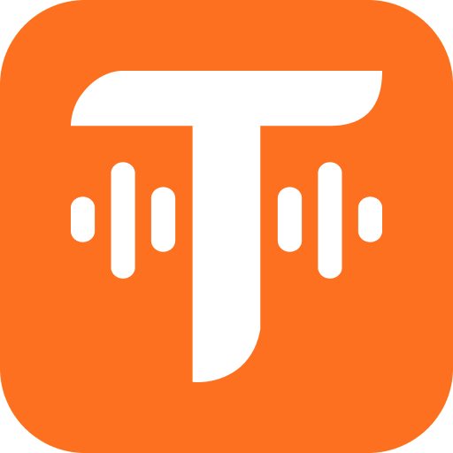

<p align="center">
  
</p>

<p align="center">AI-powered phone calls, task management, and contact organization</p>

<p align="center">
  <a href="https://telitask.io">Website</a> ·
  <a href="#mcp-server">MCP Server</a> ·
  <a href="https://github.com/Telitask/telitask-ai/issues">Report Bug</a> ·
  <a href="https://github.com/Telitask/telitask-ai/discussions">Discussions</a>
</p>

---

## Features

- **AI Voice Calls** — Make and receive phone calls with AI-generated transcripts and summaries
- **Contact Management** — Organize and manage your contacts
- **Task Tracking** — Create, assign, and track tasks
- **MCP Server** — Integrate with Claude Desktop, Claude Code, Cursor, and more

## MCP Server

The [`@telitask/mcp-server`](https://www.npmjs.com/package/@telitask/mcp-server) package lets you manage contacts, tasks, and calls directly from your AI assistant.

### Prerequisites

- Node.js 18+
- A [TeliTask](https://telitask.io) account

### Step 1: Authenticate

```bash
npx @telitask/mcp-server login
```

This opens your browser to sign in and authorize the MCP server.

### Step 2: Connect Your Client

<details>
<summary><strong>Claude Desktop</strong></summary>

Add to your `claude_desktop_config.json`:

- **macOS:** `~/Library/Application Support/Claude/claude_desktop_config.json`
- **Windows:** `%APPDATA%\Claude\claude_desktop_config.json`

```json
{
  "mcpServers": {
    "telitask": {
      "command": "npx",
      "args": ["-y", "@telitask/mcp-server"]
    }
  }
}
```

Restart Claude Desktop after saving.

</details>

<details>
<summary><strong>Claude Code</strong></summary>

```bash
claude mcp add telitask -- npx -y @telitask/mcp-server
```

</details>

<details>
<summary><strong>Cursor</strong></summary>

Add to `.cursor/mcp.json` in your project or globally:

```json
{
  "mcpServers": {
    "telitask": {
      "command": "npx",
      "args": ["-y", "@telitask/mcp-server"]
    }
  }
}
```

</details>

<details>
<summary><strong>VS Code (Copilot)</strong></summary>

1. Open the Command Palette (`Ctrl+Shift+P` / `Cmd+Shift+P`)
2. Run **MCP: Add Server**
3. Select **Command (stdio)**
4. Enter command: `npx -y @telitask/mcp-server`
5. Name it `telitask`

Or add manually to `.vscode/settings.json`:

```json
{
  "mcp": {
    "servers": {
      "telitask": {
        "command": "npx",
        "args": ["-y", "@telitask/mcp-server"]
      }
    }
  }
}
```

</details>

<details>
<summary><strong>Windsurf</strong></summary>

Add to your `mcp_config.json`:

```json
{
  "mcpServers": {
    "telitask": {
      "command": "npx",
      "args": ["-y", "@telitask/mcp-server"]
    }
  }
}
```

</details>

> **Note:** Don't see your client? Most MCP-compatible tools use the same config format. Check your client's MCP documentation and use the config above.

### Available Tools

| Tool | Description |
|------|-------------|
| `call_me` | Request a call to your phone |
| `make_call` | Make a call to a contact |
| `schedule_call` | Schedule a call for later |
| `cancel_call` | Cancel a scheduled call |
| `list_calls` | List call history |
| `get_call` | Get call details with transcript |
| `list_contacts` | List your contacts |
| `create_contact` | Create a new contact |
| `list_tasks` | List your tasks |
| `create_task` | Create a new task |
| `update_task` | Update an existing task |

## Changelog

See [CHANGELOG.md](CHANGELOG.md) for release history.

## License

© 2026 Telitask. All rights reserved.
